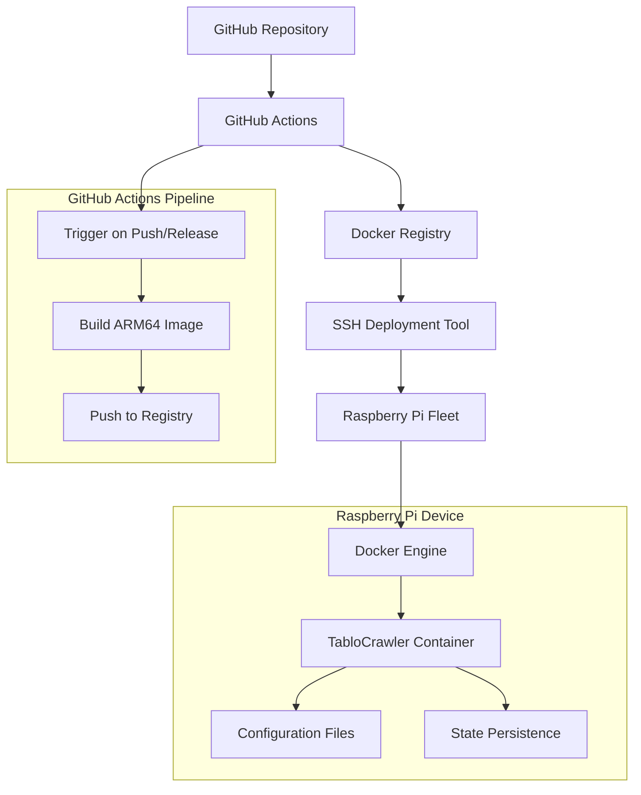

# Design Document

## Overview

This design establishes a complete deployment pipeline for TabloCrawler's user-monitoring functionality on Raspberry Pi devices. The solution consists of two main components:

1. **GitHub Actions Pipeline**: Builds ARM64 Docker images specifically for Raspberry Pi
2. **SSH-based Configuration Management**: Automated deployment and configuration tool similar to Ansible

The Docker container will run only the `watch-users` command from TabloCrawler, providing continuous monitoring of specific users' table participation activities.

## Architecture

### High-Level Architecture



### Component Interaction

1. **Code Push/Release** triggers GitHub Actions workflow
2. **GitHub Actions** builds ARM64 Docker image using native ARM64 runners
3. **Docker image** is pushed to container registry (GitHub Container Registry)
4. **Manual deployment** using SSH deployment tool connects to Raspberry Pi devices
5. **Deployment tool** pulls latest image and configures containers
6. **TabloCrawler container** runs user-monitoring functionality continuously

## Components and Interfaces

### 1. GitHub Actions Workflow

**File**: `.github/workflows/docker-build.yml`

**Responsibilities**:
- Build ARM64 Docker images for Raspberry Pi
- Push images to GitHub Container Registry
- Tag images appropriately based on triggers

**Key Features**:
- Uses native ARM64 GitHub runners for efficient builds
- Builds only on push to main branch and on releases
- Builds on pull requests for validation without registry push
- Creates versioned tags for releases and latest tag for main branch
- No connection to Raspberry Pi devices (deployment is manual)

### 2. Dockerfile

**File**: `Dockerfile`

**Responsibilities**:
- Create minimal container image for user-monitoring
- Install Bun runtime and dependencies
- Set up proper entrypoint for watch-users command

**Key Features**:
- Multi-stage build for smaller final image
- ARM64 architecture support
- Proper signal handling for graceful shutdown
- Volume mounts for configuration and state persistence

### 3. Ansible Deployment Automation

**Files**: 
- `deploy/playbook.yml` - Main Ansible playbook
- `deploy/inventory.yml` - Ansible inventory file
- `deploy/roles/` - Ansible roles for modular deployment

**Responsibilities**:
- Connect to Raspberry Pi devices via SSH using Ansible
- Install Docker if not present using ansible.builtin.package
- Deploy and configure TabloCrawler containers using community.docker collection
- Manage systemd services for auto-restart using ansible.builtin.systemd

**Key Features**:
- Native Ansible inventory management
- Parallel deployment support via Ansible's built-in parallelism
- Jinja2 templating integrated with Ansible
- Idempotent operations and built-in error handling
- Role-based organization for reusability

### 4. Configuration Management

**Files**: 
- `deploy/inventory.yml` - Ansible inventory file
- `deploy/group_vars/` - Group-specific variables
- `deploy/host_vars/` - Host-specific variables
- `deploy/templates/` - Jinja2 templates for configuration files
- `deploy/vault.yml` - Ansible Vault for encrypted secrets

**Responsibilities**:
- Define target devices using Ansible inventory format
- Template configuration files using Ansible's native Jinja2 support
- Manage secrets using Ansible Vault encryption
- Organize variables by groups and individual hosts

## Data Models

### Ansible Inventory Schema

```yaml
all:
  children:
    raspberry_pis:
      hosts:
        pi-kitchen:
          ansible_host: 192.168.1.100
          ansible_user: pi
          ansible_ssh_private_key_file: ~/.ssh/id_rsa
          environment: production
          monitoring_interval: 30
          search_radius: "5"
        pi-living-room:
          ansible_host: 192.168.1.101
          ansible_user: pi
          ansible_ssh_private_key_file: ~/.ssh/id_rsa
          environment: production
      vars:
        ansible_python_interpreter: /usr/bin/python3
```

### Ansible Variables Schema

```yaml
# Group variables (group_vars/raspberry_pis.yml)
docker_image: "ghcr.io/{{ github_repo }}/tablocrawler"
image_tag: "{{ ansible_env.IMAGE_TAG | default('latest') }}"
container_name: "tablocrawler-monitor"

# Default configuration
default_monitoring_interval: 60
default_days_to_scan: 10
default_search_latitude: "45.408153"
default_search_longitude: "11.875273"
default_search_radius: "4"

# Encrypted secrets (vault.yml)
vault_tablo_auth_token: "encrypted_token_here"
vault_telegram_bot_token: "encrypted_token_here"
vault_telegram_chat_id: "encrypted_chat_id_here"
```

### Docker Compose Template (templates/docker-compose.yml.j2)

```yaml
version: '3.8'
services:
  tablocrawler:
    image: "{{ docker_image }}:{{ image_tag }}"
    container_name: "{{ container_name }}"
    restart: unless-stopped
    environment:
      - TABLO_AUTH_TOKEN={{ vault_tablo_auth_token }}
      - TELEGRAM_BOT_TOKEN={{ vault_telegram_bot_token }}
      - TELEGRAM_CHAT_ID={{ vault_telegram_chat_id }}
      - USER_IDS_FILE_PATH=/app/data/monitored-users.txt
      - STATE_FILE_PATH=/app/data/monitoring-state.json
      - MONITORING_INTERVAL_SECONDS={{ monitoring_interval | default(default_monitoring_interval) }}
      - DAYS_TO_SCAN={{ days_to_scan | default(default_days_to_scan) }}
      - SEARCH_LATITUDE={{ search_latitude | default(default_search_latitude) }}
      - SEARCH_LONGITUDE={{ search_longitude | default(default_search_longitude) }}
      - SEARCH_RADIUS={{ search_radius | default(default_search_radius) }}
    volumes:
      - ./data:/app/data
      - ./config:/app/config
    command: ["watch-users"]
```

## Error Handling

### GitHub Actions Error Handling

1. **Build Failures**: Fail fast with clear error messages
2. **Registry Push Failures**: Retry with exponential backoff
3. **ARM64 Build Issues**: Validate GitHub ARM64 runner availability and configuration

### Ansible Deployment Error Handling

1. **Connection Failures**: Ansible automatically skips unreachable hosts and continues with others
2. **Docker Installation Failures**: Use Ansible's package module with proper error handling and retries
3. **Container Deployment Failures**: Implement rollback tasks using Ansible handlers and rescue blocks
4. **Configuration Errors**: Use Ansible's template validation and check mode for dry-run testing

### Container Runtime Error Handling

1. **API Failures**: Implement retry logic with exponential backoff
2. **Configuration Errors**: Fail fast with clear error messages
3. **State Persistence Failures**: Continue monitoring but log warnings
4. **Network Issues**: Retry with circuit breaker pattern

## Testing Strategy

### GitHub Actions Testing

1. **Unit Tests**: Test workflow syntax and logic
2. **Integration Tests**: Build test images and verify functionality
3. **ARM64 Build Tests**: Verify ARM64 builds work correctly on native runners

### Ansible Playbook Testing

1. **Syntax Validation**: Use `ansible-playbook --syntax-check` for syntax validation
2. **Dry Run Testing**: Use `ansible-playbook --check` for dry-run validation
3. **Integration Tests**: Test against local Docker containers using Ansible
4. **End-to-End Tests**: Deploy to test Raspberry Pi devices using staging inventory

### Container Testing

1. **Smoke Tests**: Verify container starts and basic functionality
2. **Configuration Tests**: Test various configuration scenarios
3. **Monitoring Tests**: Verify user monitoring functionality works correctly

### Deployment Validation

1. **Health Checks**: Verify containers are running and healthy
2. **Functionality Tests**: Verify monitoring is working correctly
3. **Performance Tests**: Monitor resource usage on Raspberry Pi

## Security Considerations

### Container Security

1. **Non-root User**: Run container processes as non-root user
2. **Minimal Base Image**: Use minimal base image to reduce attack surface
3. **Read-only Filesystem**: Mount application code as read-only
4. **Secret Management**: Use environment variables for sensitive data

### Ansible Security

1. **Key-based Authentication**: Configure SSH keys in Ansible inventory
2. **Limited User Privileges**: Use dedicated deployment user with minimal privileges
3. **Connection Security**: Leverage Ansible's built-in SSH connection management and multiplexing
4. **Vault Encryption**: Use Ansible Vault for encrypting sensitive variables

### Configuration Security

1. **Secret Encryption**: Encrypt sensitive configuration values at rest
2. **Access Control**: Limit access to configuration files and deployment tools
3. **Audit Logging**: Log all deployment activities and configuration changes

## Deployment Process

### Initial Setup

1. **Generate SSH Keys**: Create deployment keys for Raspberry Pi access
2. **Configure Ansible Inventory**: Define target devices in Ansible inventory format
3. **Set up Ansible Vault**: Configure encrypted secrets using `ansible-vault`
4. **Test Connectivity**: Verify SSH access using `ansible all -m ping`

### Ansible Deployment

1. **Image Build**: GitHub Actions builds and pushes new image automatically
2. **Manual Deployment Trigger**: Developer runs `ansible-playbook` command locally
3. **Device Preparation**: Ansible installs Docker and creates necessary directories
4. **Configuration Deployment**: Ansible templates and deploys configuration files
5. **Container Deployment**: Ansible pulls image and starts containers using community.docker collection
6. **Health Verification**: Ansible verifies containers are running using built-in modules

### Rollback Process

1. **Identify Issues**: Monitor logs and health checks for problems
2. **Stop Current Containers**: Use Ansible to gracefully stop problematic containers
3. **Deploy Previous Version**: Run Ansible playbook with previous known-good image tag
4. **Verify Rollback**: Use Ansible tasks to confirm previous version is working correctly
5. **Investigate Issues**: Analyze logs using Ansible's log collection capabilities