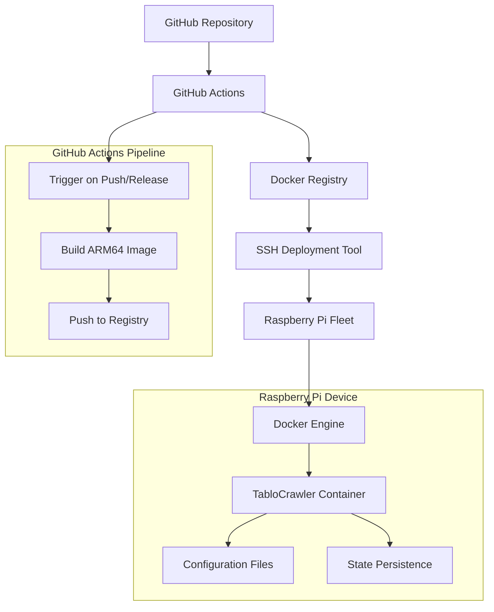

# Design Document

## Overview

This design establishes a complete deployment pipeline for TabloCrawler's user-monitoring functionality on Raspberry Pi devices. The solution consists of two main components:

1. **GitHub Actions Pipeline**: Builds ARM64 Docker images specifically for Raspberry Pi
2. **SSH-based Configuration Management**: Automated deployment and configuration tool similar to Ansible

The Docker container will run only the `watch-users` command from TabloCrawler, providing continuous monitoring of specific users' table participation activities.

## Architecture

### High-Level Architecture



### Component Interaction

1. **Code Push/Release** triggers GitHub Actions workflow
2. **GitHub Actions** builds ARM64 Docker image using native ARM64 runners
3. **Docker image** is pushed to container registry (GitHub Container Registry)
4. **Manual deployment** using SSH deployment tool connects to Raspberry Pi devices
5. **Deployment tool** pulls latest image and configures containers
6. **TabloCrawler container** runs user-monitoring functionality continuously

## Components and Interfaces

### 1. GitHub Actions Workflow

**File**: `.github/workflows/docker-build.yml`

**Responsibilities**:
- Build ARM64 Docker images for Raspberry Pi
- Push images to GitHub Container Registry
- Tag images appropriately based on triggers

**Key Features**:
- Uses native ARM64 GitHub runners for efficient builds
- Builds only on push to main branch and on releases
- Creates versioned tags for releases and latest tag for main branch
- No connection to Raspberry Pi devices (deployment is manual)

### 2. Dockerfile

**File**: `Dockerfile`

**Responsibilities**:
- Create minimal container image for user-monitoring
- Install Bun runtime and dependencies
- Set up proper entrypoint for watch-users command

**Key Features**:
- Multi-stage build for smaller final image
- ARM64 architecture support
- Proper signal handling for graceful shutdown
- Volume mounts for configuration and state persistence

### 3. SSH Deployment Tool

**File**: `deploy/raspberry-pi-deploy.py`

**Responsibilities**:
- Connect to Raspberry Pi devices via SSH
- Install Docker if not present
- Deploy and configure TabloCrawler containers
- Manage systemd services for auto-restart

**Key Features**:
- Inventory-based device management
- Parallel deployment support
- Configuration templating with Jinja2
- Error handling and rollback capabilities

### 4. Configuration Management

**Files**: 
- `deploy/inventory.yml` - Device inventory
- `deploy/templates/` - Configuration templates
- `deploy/configs/` - Environment-specific configs

**Responsibilities**:
- Define target devices and their properties
- Template configuration files for different environments
- Manage secrets and sensitive configuration

## Data Models

### Device Inventory Schema

```yaml
devices:
  - name: "pi-kitchen"
    host: "192.168.1.100"
    user: "pi"
    ssh_key: "~/.ssh/id_rsa"
    environment: "production"
    config_overrides:
      monitoring_interval: 30
      search_radius: "5"
  - name: "pi-living-room"
    host: "192.168.1.101"
    user: "pi"
    ssh_key: "~/.ssh/id_rsa"
    environment: "production"
```

### Configuration Template Schema

```yaml
# Environment configuration
tablo_auth_token: "{{ secrets.tablo_auth_token }}"
telegram_bot_token: "{{ secrets.telegram_bot_token }}"
telegram_chat_id: "{{ secrets.telegram_chat_id }}"

# Monitoring configuration
user_ids_file_path: "/app/data/monitored-users.txt"
state_file_path: "/app/data/monitoring-state.json"
monitoring_interval_seconds: "{{ config.monitoring_interval | default(60) }}"
days_to_scan: "{{ config.days_to_scan | default(3) }}"

# Location configuration
search_latitude: "{{ config.latitude | default('45.408153') }}"
search_longitude: "{{ config.longitude | default('11.875273') }}"
search_radius: "{{ config.search_radius | default('4') }}"
```

### Docker Compose Template

```yaml
version: '3.8'
services:
  tablocrawler:
    image: "ghcr.io/{{ github_repo }}/tablocrawler:{{ image_tag }}"
    container_name: tablocrawler-monitor
    restart: unless-stopped
    environment:
      - TABLO_AUTH_TOKEN={{ tablo_auth_token }}
      - TELEGRAM_BOT_TOKEN={{ telegram_bot_token }}
      - TELEGRAM_CHAT_ID={{ telegram_chat_id }}
      - USER_IDS_FILE_PATH=/app/data/monitored-users.txt
      - STATE_FILE_PATH=/app/data/monitoring-state.json
      - MONITORING_INTERVAL_SECONDS={{ monitoring_interval_seconds }}
      - DAYS_TO_SCAN={{ days_to_scan }}
      - SEARCH_LATITUDE={{ search_latitude }}
      - SEARCH_LONGITUDE={{ search_longitude }}
      - SEARCH_RADIUS={{ search_radius }}
    volumes:
      - ./data:/app/data
      - ./config:/app/config
    command: ["watch-users"]
```

## Error Handling

### GitHub Actions Error Handling

1. **Build Failures**: Fail fast with clear error messages
2. **Registry Push Failures**: Retry with exponential backoff
3. **ARM64 Build Issues**: Validate GitHub ARM64 runner availability and configuration

### SSH Deployment Error Handling

1. **Connection Failures**: Skip unreachable devices, continue with others
2. **Docker Installation Failures**: Provide manual installation instructions
3. **Container Deployment Failures**: Rollback to previous version if available
4. **Configuration Errors**: Validate templates before deployment

### Container Runtime Error Handling

1. **API Failures**: Implement retry logic with exponential backoff
2. **Configuration Errors**: Fail fast with clear error messages
3. **State Persistence Failures**: Continue monitoring but log warnings
4. **Network Issues**: Retry with circuit breaker pattern

## Testing Strategy

### GitHub Actions Testing

1. **Unit Tests**: Test workflow syntax and logic
2. **Integration Tests**: Build test images and verify functionality
3. **ARM64 Build Tests**: Verify ARM64 builds work correctly on native runners

### Deployment Tool Testing

1. **Unit Tests**: Test individual functions and modules
2. **Integration Tests**: Test against local Docker containers
3. **End-to-End Tests**: Deploy to test Raspberry Pi devices

### Container Testing

1. **Smoke Tests**: Verify container starts and basic functionality
2. **Configuration Tests**: Test various configuration scenarios
3. **Monitoring Tests**: Verify user monitoring functionality works correctly

### Deployment Validation

1. **Health Checks**: Verify containers are running and healthy
2. **Functionality Tests**: Verify monitoring is working correctly
3. **Performance Tests**: Monitor resource usage on Raspberry Pi

## Security Considerations

### Container Security

1. **Non-root User**: Run container processes as non-root user
2. **Minimal Base Image**: Use minimal base image to reduce attack surface
3. **Read-only Filesystem**: Mount application code as read-only
4. **Secret Management**: Use environment variables for sensitive data

### SSH Security

1. **Key-based Authentication**: Use SSH keys instead of passwords
2. **Limited User Privileges**: Use dedicated deployment user with minimal privileges
3. **Connection Security**: Use SSH agent forwarding and connection multiplexing

### Configuration Security

1. **Secret Encryption**: Encrypt sensitive configuration values at rest
2. **Access Control**: Limit access to configuration files and deployment tools
3. **Audit Logging**: Log all deployment activities and configuration changes

## Deployment Process

### Initial Setup

1. **Generate SSH Keys**: Create deployment keys for Raspberry Pi access
2. **Configure Inventory**: Define target devices and their properties
3. **Set up Secrets**: Configure encrypted secrets for API tokens
4. **Test Connectivity**: Verify SSH access to all target devices

### Manual Deployment

1. **Image Build**: GitHub Actions builds and pushes new image automatically
2. **Manual Deployment Trigger**: Developer runs deployment tool locally
3. **Device Preparation**: Install Docker and create necessary directories
4. **Configuration Deployment**: Template and deploy configuration files
5. **Container Deployment**: Pull image and start containers
6. **Health Verification**: Verify containers are running correctly

### Rollback Process

1. **Identify Issues**: Monitor logs and health checks for problems
2. **Stop Current Containers**: Gracefully stop problematic containers
3. **Deploy Previous Version**: Use previous known-good image version
4. **Verify Rollback**: Confirm previous version is working correctly
5. **Investigate Issues**: Analyze logs to understand deployment problems